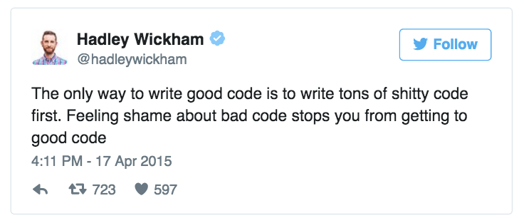

  
```{r, echo = F, message = F}
library(tidyverse)
```

# 3. Writing scripts

## What is a script?

- A sequence of commands to be passed to the console
- e.g., a complete analysis - data import, analysis, plotting, data export

## Part of a script...


## 

The script is a record of your analysis! It should be well annotated ("commented"), logically structured and clear - and it should work!

You should be able to give somebody else the script, any dependent files, and they should be able to run it without errors, and find it easy to make additions/edits if necessary.

##


##



##

"Am I going to remember what this means if I don't look at it for the next month?"

## Simple tips

##

Comment your code!

```{r}
# Lines beginning with # will not be interpreted by R
```

##

Indent code where you have multi-line expressions

```{r, eval = F}
first_vals <- split(mtcars, mtcars$cyl) %>%
  map_df( ~ data.frame(
    hp = first(.$hp),
    wt = first(.$wt)
  )
)
```

##

Don't nest too many functions in one another...

Bad:
```{r, eval = F}
data.in <- read.delim(file, skip = as.numeric(unlist(regmatches(readLines(file, n = 2)[2], gregexpr('\\(?[0-9,.]+', .)))) - 1, dec = dec)
```

Better! (with annotations!):

```{r, eval = F}
data.in <- file %>% 
  readLines(n = 2) %>%                        # Read top 2 lines from file
  .[2] %>%                                    # Read 2nd line only
  regmatches(gregexpr('\\(?[0-9,.]+', .)) %>% # Extract number from that line
  unlist %>%                                  # Convert out of list format...
  as.numeric %>%                              # ...and to numeric
  -1 %>%                                      # Number of header lines to skip is this number minus one.
  read.delim(file, skip = ., dec = dec)       # Now read in the file, skip that number of lines
```

##

Give objects meaningful names (tempting as it is to call them `blah` or `a` or `b` sometimes...)

And also it's best not to give objects the same names as existing functions (`data`, `c`, `raw` etc) - it can cause trouble...


# Write your own functions!

##

Writing a function is easy.

```{r, eval = F}
function_name <- function(arg1, arg2, ...) {
  # whatever the function does goes in here
}
```

##

Here's a simple function that adds 1 to whatever number you give it:

```{r}
plus_one <- function(x) {
  x + 1
}
```

Let's try it out...

```{r}
plus_one(2)
plus_one(6)
```

##

You can specify as many arguments as needed...

```{r}
multiply_together <- function(x, y, z) {
  x * y * z
}
```

```{r}
multiply_together(2, 3, 6)
```

##

You can do any number of operations within a function call, and by default the function will return the result of the **last** operation:

```{r}
function_a <- function(x, y) {
  
  x + y
  x - y
  x * y
}
```

```{r}
function_a(8, 3)
```

##

If you want the function to return something else other than the last operation, create an object within the function and use the `return()` function:

```{r}
function_b <- function(x, y) {
  
  a <- x + y
  b <- x - y
  c <- x * y
  
  return(b)
}
```

```{r}
function_b(8, 3)
```

The function **exits** when it sees the `return()` function, so put it at the end!

##

The function can return whatever output you wish.

```{r}
function_c <- function(x, y) {
  
  a <- x + y
  b <- x - y
  c <- x * y
  
  return(list(a = a, b = b, c = c))
}
```

```{r}
function_c(8, 3)
```

##

There are no restrictions on data types by default.

```{r}
function_c(c(1:10), 3)
```

##

You can specify default arguments:

```{r}
function_d <- function(x = 4, y = 7) {
  x + y
}
```

```{r}
function_d()
function_d(x = 2)
function_d(y = 8)
```

##

Functions can be functions of other functions:

```{r}
sum_mean <- function(x) {
  sum(x) / length(x)
}
```

```{r}
a <- rnorm(50)
sum_mean(a)
mean(a)
```

# if/else

##

General form:

```{r, eval = F}
if (condition) {
  # do something
} else {
  # otherwise do something else
}
```

##

A simple example:

```{r}
x <- 10
```

```{r}
if (x < 5) {
  TRUE
} else {
  FALSE
}
```

You don't have to specify an `else` condition, but if the condition is not `TRUE`, there will be no output.

##

`else if`: you can chain together as many if statements as you like, if you want the output to be different for different conditions:

```{r}
if (x < 5) {
  TRUE
} else if (x < 15) {
  "bananas"
} else {
  FALSE
}
```

##

Multiple conditions:

- `&&` = 'and'
- `||` = 'or'

```{r}
if (x < 5 || x %% 2 == 0) {
  TRUE
} else {
  FALSE
}
```

(`x %% 2 == 0` checks if the remainder of `x` divided by 2 is zero.)

##

A function with an `if` statement!

```{r}
function_e <- function(x) {

  if (x < 5 || x %% 2 == 0) {
    y <- x + 3
  } else {
    y <- x - 3
  }
  
  return(y)
}
```

```{r}
function_e(17)
function_e(2)
```

## `ifelse()`

There's a very useful function in R to make simple if/else statements:

```{r, eval = F}
ifelse(condition, if_true, if_false)
```

```{r}
x <- 13
ifelse(x > 10, "apples", "bananas")
ifelse(x > 10, x^2, log(x))
```

# loops

##

```{r, eval = F}
for (number in sequence) {
  # do something
}
```

##

```{r}
for (i in 1:5) {
  print(i * 2)
}
```

##

```{r}
for (i in c(10, 25, 50, 75, 100)) {
  print(i * 2)
}
```

##

```{r}
for (i in c(10, 25, 50, 75, 100)) {
  
  ifelse(i %% 2 == 0, print("apples"), print("bananas"))
  
}
```

##

You want to store output in a vector (or other data structure). For efficiency reasons, it is recommended to initialise it first:

```{r}
sequence <- c(10, 25, 50, 75, 100)
out <- vector(mode = "character", length = length(sequence))
for (i in seq_along(sequence)) {
  
  ifelse(sequence[i] %% 2 == 0, out[i] <- "apples", out[i] <- "bananas")
  
}
out
```

but doesn't this look rather complicated??

##

Let's make a function:

```{r}
div_by_2 <- function(x) {
  ifelse(x %% 2 == 0, "apples", "bananas")
}

div_by_2(13)
div_by_2(16)
```

## the `apply()` functions

the `apply()` series of functions are base R functions which are preferable to `for` loops in most cases... once you understand how they work.

The most useful (in my opinion) is `lapply`:

```{r, eval = F}
lapply(x, FUN, ...)
```

`x` is a `vector` or a `list`.

> `lapply` returns a `list` of the same length as `x`, each element of which is the result of applying `FUN` to the corresponding element of `x`

##

```{r}
lapply(c(10, 25, 50, 75, 100), div_by_2)
```

##

`lapply()` always returns a list, `sapply()` returns a vector:

```{r}
sapply(c(10, 25, 50, 75, 100), div_by_2)
```

##

`lapply()` is very powerful, for running the same operation over and over again:

```{r}
library(readxl)
path <- "rfps-datasets1.xlsx"

l <- lapply(excel_sheets(path), read_excel, path = path)
str(l)
```
##

Any extra arguments to `lapply` are passed as extra arguments to the specified function.

```{r}
l2 <- lapply(l, select, 1, 2, 3)
str(l2)
```

## anonymous functions

You don't have to define a function to use it in an `lapply()` call. Remember...

```{r, eval = F}
div_by_2 <- function(x) {
  ifelse(x %% 2 == 0, "apples", "bananas")
}

lapply(c(10, 25, 50, 75, 100), div_by_2)
```

##

This is the same as:

```{r}
lapply(c(10, 25, 50, 75, 100), function(x) {
  ifelse(x %% 2 == 0, "apples", "bananas")
})
```

## `while()`

`while()` is useful if you don't know how long the loop will necessarily run:

```{r}
x <- 1

while(x < 5) {
  x <- x + 1 
  print(x)
}
```

##

`next` can be used to skip one step of the loop. For example, if we want to skip `print`ing `x` when `x == 3`:

```{r}
x <- 1

while(x < 5) {
  x <- x + 1
  if (x == 3) next
  print(x)
}
```

##

```{r}
x <- 1

while(x < 5) {
  x <- x + 1
  if (x == 3) break
  print(x)
}
```

# error handling

##

Various error-handling functions can be included in your own functions, to protect against unexpected output or input. You can customise your own error messages...

- `stop()` - stops the function immediately, with a specified error message
- `warning()` - passes a warning, but does not stop the function

##

```{r, error = T}
add_together <- function(x, y) {
  x + y
}

add_together(2, 3)
add_together("a", 3)
```

##

use `is.[class]` to check data type:

```{r, error = T}
add_together2 <- function(x, y) {
  
  if (is.character(x) || is.character(y)) stop("arguments cannot be characters")
  x + y

  }

add_together2("a", 3)
```

##

or `!is.[class]` to check if the data type is **different**:

```{r, error = T}
add_together3 <- function(x, y) {
  
  if (!is.numeric(x) || !is.numeric(y)) stop("arguments must be numbers")
  x + y

}

add_together3("a", 3)
```

##

use `any()` if you want to check if any of the conditions are true or false:

```{r, error = T}
add_together4 <- function(x, y) {
  
  if (any(!is.numeric(c(x, y)))) stop("arguments must be numbers")
  x + y

}

add_together4("a", 3)
add_together4(7, 2)
```

##

`tryCatch()` lets you try and evaluate an expression, and specify a value to return in case of error:

```{r, error = T}
add_together5 <- function(x, y) {
  
  if (any(!is.numeric(c(x, y)))) warning("arguments must be numbers")
  tryCatch(x + y, error = function(e) NA)

}

add_together5("a", 3)
```

##

reminder: `add_together4()` stops the function - `add_together5()` gives a warning and returns `NA`

```{r, error = T}
lapply(list(1, "a", 3), add_together4, y = 5)
lapply(list(1, "a", 3), add_together5, y = 5)
```

# That's all for today!

## key functions:

- `function(...)`
- `if`, `else`, `ifelse`, `||`, `&&`, `!`, `any()`
- `for`, `while`, `next`, `break` 
- `lapply()`, `sapply()`, `*apply()`
- `stop()`, `warning()`, `tryCatch()`