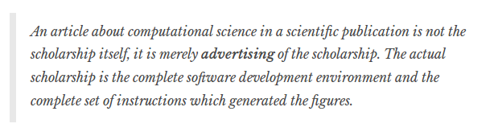

```{r, echo = F, message = F}
library(tidyverse)
```

# 4. Creating reports


## The motivation

**Reproducible research**

"Reproducibility is one of the cornerstones of science".

Problem: computers wrangle the data, but also obscure it. It's practically impossible to ensure reproduciblity at some later time, even on the same computer with the same operator!


## How much transparency do scientists owe?



Even if you are not a computational scientist, reproducibility cannot be achieved without sharing both data and code (in addition to the manuscript).


##

<h4>Open formats and free software are a win/win</h4>


##

*This all sounds very tedious and time-consuming.*


## The good news: you already have the tools to do it!

"If we imagine the learning curve is a fence, you already have one leg over. Just keep going."


## Read more about reproducibility


- ["Good Enough Practices for Scientific Computing", by Wilson, Bryan, Cranston, Kitzes, Nederbragt, and Teal (2016)](http://swcarpentry.github.io/good-enough-practices-in-scientific-computing/)
- ["How computers broke science - and what we can do to fix it", The Conversation (2015)](http://theconversation.com/how-computers-broke-science-and-what-we-can-do-to-fix-it-49938)
- ["Why scientists must share their research code", Monya Baker, Nature (2016)](http://www.nature.com/news/why-scientists-must-share-their-research-code-1.20504)


# Outline for today's hands-on session


## These slides are online

**[https://github.com/chepec/rfps](http://htmlpreview.github.io/?https://github.com/chepec/rfps/blob/master/slides/4-reports.html)**


## Create an RStudio project

- First, create a new directory,
- then create a new project in that directory using the Project menu

Help: https://support.rstudio.com/hc/en-us/articles/200526207-Using-Projects


## Create an R Markdown report

Using R Markdown we can combine manuscript (formatted using R Markdown), data and code (the latter two handled by R) in one single document ("report").

Use your own data or some built-in dataset.

Tip: you'll need `library(knitr)`

Help:
http://rmarkdown.rstudio.com/lesson-1.html
http://yihui.name/knitr/demos/


##

Put text (feel free to experiment with headers, bullet points, cursive, boldface, etc.), import data and do something with it (at least create **one plot and one table**).

For tables, we suggest using knitr's `kable()` function to output a dataframe as a Markdown table.


## Knit your markdown file into

- HTML, or
- PDF, or
- MS Word

And explore the knitting "Output options" for the different formats.
(These conversions are done using **pandoc**).


## Put your project under version control

Use RStudio's built-in GUI for Git.

- [Using Git with RStudio (short guide)](https://jennybc.github.io/2014-05-12-ubc/ubc-r/session03_git.html)
- [Why you need version control (the why)](http://ellisp.github.io/blog/2016/09/16/version-control)
- [Happy Git and GitHub for the useR (online book)](http://happygitwithr.com/)


## For the advanced user

- It's perfectly possible to combine `R` and `LaTeX` using `knitr`
- You can include plots as png/pdf, or for complete integration with `LaTeX`: as TikZ files (renders the plot using the same font and so on as the rest of the document).
- Git is a *distributed* version control software, so it's entirely possible to write a manuscript/code collaboratively with others while keeping track of who did what.

Feel free to ask questions!


# R community resources

## Use the community to find help

- Hone your Google-fu! Always due your due diligence first.
- http://stackoverflow.com/questions/tagged/r
- http://stats.stackexchange.com


##

- Matt Lacey: [lacey.se](http://lacey.se/), [github](https://github.com/mjlacey), @[mjlacey](https://twitter.com/mjlacey)
- Taha Ahmed: [chepec.se](https://chepec.se), [github](https://github.com/chepec), @[solarchemist](https://twitter.com/solarchemist)

Check out Matt's [post (from yesterday) on dual y-axis in ggplot2](http://lacey.se/2016/09/21/a-half-solution-for-multiple-y-axes-with-ggplot/).


# Be a better scientist with open formats and free software!
